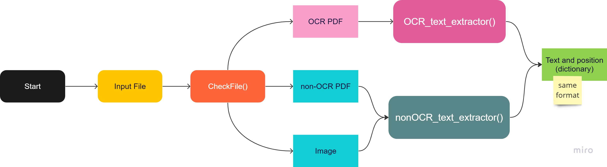
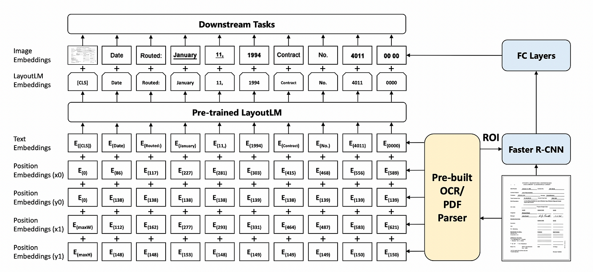

# Portofolio
---
## Data Science

### Thesis : Session-based Recommendation System using Gated Graph Neural Network and Attention Mechanism on E-commerce Dataset

{:target="_blank"}

The primary objective of this research is to develop a session-based recommendation system that leverages a Gated Graph Neural Network (GGNN) to amalgamate global preferences, current interests, and user-specific preferences.
The research encompasses several stages, including data pre-processing, session graph construction, item embedding, session embedding, recommendation generation, and model evaluation.The research findings demonstrate that the proposed model exhibits superior performance compared to other models on both datasets. In the Yoochoose dataset, the Recall@20 achieved an impressive 70.81%, with MRR@20 reaching 31.05%. Meanwhile, the Diginetica dataset yielded a Recall@20 of 50.08% and an MRR@20 of 17.80%. These results signify the model's effectiveness in providing top-tier recommendations.

 

---

### Named Entity Recognition (NER) using LayoutLM

{:target="_blank"}

Working on a project that involves utilizing LayoutLM, a multimodal Transformer model designed for document image understanding and information extraction. This technology has promising applications in text comprehension and receipt understanding. Named Entity Recognition, a critical task, involves the identification and categorization of entities like individual names, organizations, locations, dates, and more within a given text. The innovative aspect of LayoutLM lies in its extension of this task to encompass the visual layout of text. This includes factors such as the positioning of text, font styles, and formatting details. Through my project, I am creating a system that can automatically extract and categorize named entities present in various documents. By combining the capabilities of language comprehension with visual layout analysis, I aim to achieve a more accurate identification of entities. This approach becomes particularly valuable in cases where conventional NER methods face challenges due to the diverse formats and structures of documents.

Original LayoutLM paper: https://arxiv.org/abs/1912.13318

LayoutLM docs in the Transformers library: https://huggingface.co/transformers/model_doc/layoutlm.html

 

---

---

### Document Classification using LayoutLM

{:target="_blank"}

In this project, I am exploring document classification using LayoutLM, a pre-trained model for document image understanding. The goal of this project is to provide an overview of how to use LayoutLM for document classification, including how to prepare the data, fine-tune LayoutLMForSequenceClassification the pre-trained model, and evaluate its performance on RVL-CDIP dataset. By the end of this project, we should have a good understanding of how to use LayoutLM for document classification and be able to apply these techniques to document classification tasks.

Original LayoutLM paper: https://arxiv.org/abs/1912.13318

LayoutLM docs in the Transformers library: https://huggingface.co/transformers/model_doc/layoutlm.html

 

---

### Recommender Systems on E-commerce

{:target="_blank"}

This project is a pilot project during internship. I built recommender systems for recommending products to user using Model-based recommendation system. The goal of this project is to make a recommendation system model that is more accurate than the previous model. <b>The model achieve the best performance with SVD++ where this model gets an RMSE score of 0.844 and MAE 0.384. I also use the mlflow tool to do experiment tracking.</b>

 

---
### Boston Housing Prediction with deployment

{:target="_blank"}
{:target="_blank"}

This project was started as a motivation for learning Machine Learning Algorithms and to learn the different data preprocessing techniques and <b>implement the concept of Homodescascity, Multicollinearity & Error terms distribution during data exploration. I also deploy this project in heroku. This model get R2 score of 73% and RMSE of 5.09</b>.

---
### Location Recommendation for Retail

{:target="_blank"}
{:target="_blank"}

<b>The purpose of this project is to provide location recommendations for retailers</b> who want to open offline stores. This project used to build the startup for the final project called Map.it and <b>succeeded in becoming the five best final projects during MBKM event</b>.

 

 

---
### Herd Immunity Prediction

{:target="_blank"}

<b>This project aims to predict when Indonesia will reach 60-85% herd immunity</b> with COVID-19 vaccinations. Performing time series analysis and modeling with polynomial models. <b>Using degree=3 as the best degree that gets a score of r2=0.963.</b>

 

 

---
### Market Basket Analysis

{:target="_blank"}

The objective of this project is to <b>analyze the 3 million grocery orders from more than 200,000 Instacart users and predict which previously purchased item will be in user's next order</b>. Customer segmentation and affinity analysis are done to study customer purchase patterns and for better product marketing and cross-selling. <b>Achieved the best performance using the XGBoost model with an AUC score of 0.83, an accuracy of 0.74 and an F1-score of 0.36.</b>

 

 

---

### Song Clustering using K-Means

{:target="_blank"}

Using song data in the form of components in the song such as acousticness, energy, instrumentalness etc. Reduce data from 13 data variables into 8 components and can be used in K-Means modeling K-Means++. clustering songs into 8 n_clusters.

 

 

---

### Attrition/Turnover Prediction

{:target="_blank"}

<b>In this project I conducted analysis and predictions related to turnover</b> on employee data in a company. Analysis is carried out to look for factors that cause turnover while predictions are used to predict which employees will make turnover. <b>This project also carried out several techniques such as normalization and sampling </b>(due to imbalanced data). After modeling using several classification models, especially the tree algorithm, it was found that <b>LightGBM produced the best performance with F1-score = 91% and ROC-AUC Score = 91%.This project uses kedro as a framework.</b>

 

 

---
## Data Analyst

### Olist E-Commerce Business Performance

{:target="_blank"}
{:target="_blank"}
{:target="_blank"}

In this project we have some objective to do about the bussiness performance inside Olist. I do analysis and visualization using tableau. <b>This analysis and visualization focuses on orders and transactions that occurred at olist during 2017 and 2018.</b>

 

 

---
### Uber vs Green Cabs Trip in New York City - an Analysis

{:target="_blank"}
{:target="_blank"}

Analyzing the performance of Green Cabs and Uber Taxi through visual analysis of passenger trips using Green Cabs and Uber Taxi from January to June in 2015 in the New York City area. Broadly speaking, there are two questions related to the research conducted:
<b>
<li>How do Green Cabs and Uber rides compare regionally in neighborhoods outside of New York City?</li>
<li>Do customer preferences change according to the time of day (night/day or weekend/weekday)?</li></b>

 

 

---

### Superstore Sales Dashboard

{:target="_blank"}

Created a superstore dashboard showing the sales & profit by location, segment analysis, category analysis, shipping analysis in various years of a superstore. In this project also, I have made a interactive Tableau Sales Dashboard and find some insights from the data. 

 

 

---

© 2023 Luthfi Raditya. Powered by Jekyll and the Minimal Theme.

