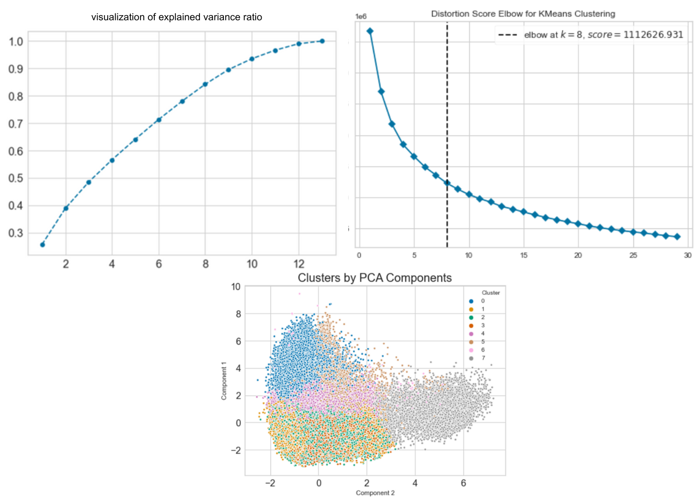

# Portfolio
---
## Data Science

### Recommender Systems on E-commerce

This project is a pilot project during internship. I built recommender systems for recommending products to user using Model-based recommendation system. The goal of this project is to make a recommendation system model that is more accurate than the previous model. The model achieve the best performance with SVD++ where this model gets an RMSE score of 0.844 and MAE 0.384. I also use the mlflow tool to do experiment tracking.

 

---
### Boston Housing Prediction with deployment

This project was started as a motivation for learning Machine Learning Algorithms and to learn the different data preprocessing techniques and implement the concept of Homodescascity, Multicollinearity & Error terms distribution during data exploration. I also deploy this project in heroku. This model get R2 score of 73% and RMSE of 5.09.

---
### Location Recommendation for Retail

The purpose of this project is to provide location recommendations for retailers who want to open offline stores. This project used to build the startup for the final project called Map.it and succeeded in becoming the five best final projects during MBKM event.

 

 

---
### Herd Immunity Prediction

First I build co-occurence matrices of ingredients from Facebook posts from 2011 to 2015. Then, to identify interesting and rare ingredient combinations that occur more than by chance, I calculate Lift and PPMI metrics. Lastly, I plot time-series data of identified trends to validate my findings. Interesting food trends have emerged from this analysis.

 

 

---
### Market Basket Analysis

The objective of this project is to analyze the 3 million grocery orders from more than 200,000 Instacart users and predict which previously purchased item will be in user's next order. Customer segmentation and affinity analysis are done to study customer purchase patterns and for better product marketing and cross-selling. achieved the best performance using the XGBoost model with an AUC score of 0.83, an accuracy of 0.74 and an F1-score of 0.36.

 

 

---

### Song Clustering using K-Means

First I build co-occurence matrices of ingredients from Facebook posts from 2011 to 2015. Then, to identify interesting and rare ingredient combinations that occur more than by chance, I calculate Lift and PPMI metrics. Lastly, I plot time-series data of identified trends to validate my findings. Interesting food trends have emerged from this analysis.

 

 

---

### Attrition/Turnover Prediction

First I build co-occurence matrices of ingredients from Facebook posts from 2011 to 2015. Then, to identify interesting and rare ingredient combinations that occur more than by chance, I calculate Lift and PPMI metrics. Lastly, I plot time-series data of identified trends to validate my findings. Interesting food trends have emerged from this analysis.

 

 

---
## Data Analyst

### Olist E-Commerce Business Performance

lorem ipsum lorem ipsum lorem ipsum lorem ipsum lorem ipsum lorem ipsum lorem ipsum lorem ipsum lorem ipsum lorem ipsum lorem ipsum lorem ipsum lorem ipsum 

 

 

---
### Uber vs Green Cabs Trip in New York City - an Analysis

I performed comprehensive EDA to understand important variables, handled missing values, outliers, performed feature engineering, and ensembled machine learning models to predict house prices. My best model had Mean Absolute Error (MAE) of 12293.919, ranking <b>95/15502</b>, approximately <b>top 0.6%</b> in the Kaggle leaderboard.

 

 

---

### Superstore Sales Dashboard

In this project I am going to perform comprehensive EDA on the breast cancer dataset, then transform the data using Principal Components Analysis (PCA) and use Support Vector Machine (SVM) model to predict whether a patient has breast cancer.

 

 

---

© 2022 Luthfi Raditya. Powered by Jekyll and the Minimal Theme.

